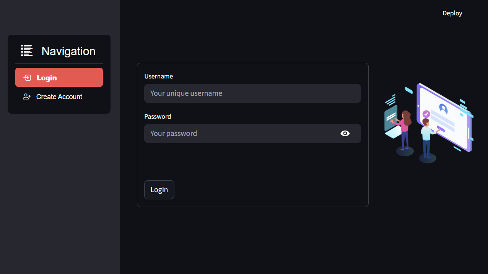

# Personal Finance Assistant

A professional-grade Streamlit application that empowers users to manage and analyze their personal expenses using AI insights. This project provides an intuitive user interface for financial goal tracking, expense categorization, and GPT-powered saving tips. The app includes secure user authentication and a backend powered by FastAPI.

---

## Features

* Upload and analyze personal expense CSV files
* Visual representation of spending patterns by category
* AI-generated financial insights and saving recommendations
* User-defined savings goals with contextual advice
* Secure login and registration system with cookie-based sessions
* Modular code structure with support for multi-user sessions

---
[🎥 Click here to view demo video](./demo.mp4)
---

## Architecture Overview

**Frontend:** Streamlit
**Backend:** FastAPI
**Authentication:** `streamlit-login-auth-ui`
**Data Visualization:** Plotly
**Storage:** Local CSV upload + JSON-based credential store (via `utils.py`)

---

## File Structure

```
GPT-personal-assistant/
├── streamlit_app.py            # Main Streamlit frontend application
├── main.py                     # FastAPI backend for data analysis and GPT integration
├── utils.py                    # User registration and credential management logic
├── _secret_auth_.json          # Stores registered users in JSON format
├── requirements.txt            # Project dependencies
└── README.md                   # Project documentation
```

---

## Installation and Setup

### Step 1: Clone the Repository

```bash
git clone https://github.com/your-username/GPT-personal-assistant.git
cd GPT-personal-assistant
```

### Step 2: Install Required Packages

```bash
pip install -r requirements.txt
```

Ensure your Python version is >= 3.9.12.

### Step 3: Run the FastAPI Backend

```bash
uvicorn main:app --reload
```

This service will be available at `http://localhost:8000/analyze`.

### Step 4: Run the Streamlit Frontend

```bash
streamlit run streamlit_app.py
```

This will launch the personal finance assistant in your browser.

---

## CSV  Format Requirements

Ensure your uploaded CSV file contains the following columns:

| Column Name | Description                             |
| ----------- | --------------------------------------- |
| Date        | Date of transaction (e.g. 2025-01-05)   |
| Amount      | Expense amount (numeric)                |
| Category    | Expense category (e.g. Rent, Food)      |
| Description | Optional description of the transaction |

Example:

```
Date,Amount,Category,Description
2025-01-03,1240.00,Rent,January rent payment
2025-01-05,89.90,Utilities,Electricity and water bill
```

---

## Authentication System


* Login and registration UI powered by `streamlit-login-auth-ui`
* Passwords hashed using Argon2 algorithm
* Cookie-based session persistence
* Password reset and email delivery functionality removed for simplicity

To register a new user, use the built-in sign-up form. User data is stored in `_secret_auth_.json` and managed via `utils.py`.

---

## API Endpoint

**POST** `/analyze`

* Accepts: Multipart-form CSV file + goal string
* Returns: JSON with summarized financial stats, GPT insights, and goal-related advice

Sample payload:

```bash
curl -X POST http://localhost:8000/analyze \
  -F "file=@expenses.csv" \
  -F "goal=Save $5000 for vacation"
```

---

## Future Improvements

* Integration with financial APIs (e.g., Plaid, YNAB)
* User dashboard with historical trends and comparisons
* Scheduled email reports and alerts
* Budget planning with predictive analytics
* Cloud-based deployment (Streamlit Cloud, Render, or AWS EC2)

---

## License

This project is licensed under the MIT License. See the `LICENSE` file for details.

---

## Maintainer

**Rashi Tyagi**
University of Illinois Urbana-Champaign
Focus: AI, Cloud Computing, and FinTech Systems

For questions or contributions, please raise an issue or submit a pull request.
